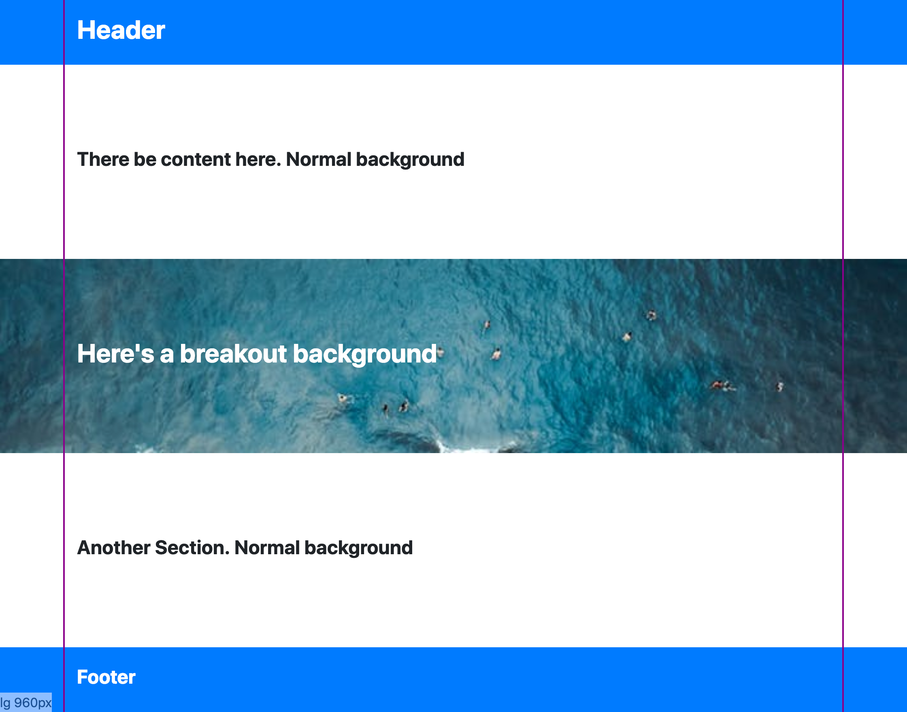

# Tips for working with CSS Grids

## Overview of Grids

A common practice in creating responsive layouts in web sites is to use what's referred to as
a grid. Grids are tools used by designers and developers alike to help layout a page, align elements within the page and help define how much of the page those elements should take up for different screen sizes.

A very common implementation is the 12 column grid which is generally used to help line up elements horizontally along "columns". They are made up of three elements:
1. A grid container, which defines the left and right side boundaries (or the width) of your site.
1. A row, which lays out grid cells, and is responsible for wrapping the cells when they don't fit.
1. A cell, which takes up space in a row. Most of the time cells take up some multiple of one 12th of the width of the grid which is how we get the 12 column effect. 


<!-- Take screenshots at 1120 x 480  -->
*The magenta outline shows the borders of the grid container. The translucent bars represent the columns that cells will align to in the grid.*

This is seen in some form or another popular CSS framework such as [Bootstrap](https://getbootstrap.com/docs/4.0/layout/grid/) and the [Foundation XY Grid](https://foundation.zurb.com/sites/docs/xy-grid.html), but can also be implemented as in the native CSS-grid if your browser supports it. All of these systems are capable of creating other kinds of layouts beyond the 12 column grid, but it is still a popular choice to use them for this purpose.

Working with a grid system like this isn't all scotches and skittles, there are some things that are untuitive or require some workarounds. Here are some of my tips for working with grids.

*This post is going to focus on implementing tips in Bootstrap with [Sass](https://sass-lang.com/), though these concepts can apply to other systems.*

## Background Breakouts

A common web site design feature is the have backgrounds that stretch out all the way the left and right edges of the viewport while the main elements of your site remain constrained inside the grid. This is called a "breakout background".

*In this design, several sections of the page have backgrounds that breakout beyond the grid container (outlined in magenta)*

The naive solution to this is to create a full width div, give it a background styling, then put a grid container inside that div. Rinse and repeat this process for every section that requires a breakout background. This could work, but it's ugly. The structure of the html has been compromised to support styling.

Our goal is that we want to have a single grid container for the whole site and still have these breakout backgrounds. We can achieve this purely in CSS without messing with our html strucure.

The trick is that we use a pseudo element at the row we want to have a breakout background from and assign the background styling to it. Then we stretch that pseudo element out to the edges of the viewport. 

First we start with a class that has a pseudo element positioned behind its content on the Z-axis:
```sass
// Apply this class to elements which should have breakout backgrounds
.breakout-background {
  position: relative;
  z-index: 0; // establish stacking context for breakout

  // Breakout background pseudo element
  &:before {
    content:'';
    position: absolute;
    height: 100%;
    z-index: -1; // pseudo element is behind content
    top:0;
    width: 100vw; // Takes up 100% of the viewport width
    background-color: blue;
  }
```
The tricky part is positioning the element horizontally. We want it to be moved left half the viewport width, but then since it's starting it's move from the left side of the grid container we have to take the size of the grid container into consideration. So after it's moved left half the viewport width it needs to move right again by half the grid container width:
```sass
    left: calc(-100vw / 2 + #{$container-max-width} / 2);
```
Now we have to figure out what the grid container width is. In Bootstrap there's a different width for every breakpoint, so we'll need our left positioning to be different for every breakpoint as well. We can accomplish this by looping over the available breakpoints Bootstrap provides:
```sass
@each $breakpoint, $container-max-width in $container-max-widths {
  @include media-breakpoint-up($breakpoint, $grid-breakpoints) {
    left: calc(-100vw / 2 + #{$container-max-width} / 2)
  }
}
```

Our final output looks like this:

```sass
@import '~bootstrap/scss/variables';
@import '~bootstrap/scss/bootstrap-grid';
@import '~bootstrap/scss/mixins';

// Apply this class to elements which should have breakout backgrounds
.breakout-background {
  position: relative; // establish breakout positioning ancestor
  z-index: 0; // establish stacking context for breakout

  // Breakout background pseudo element
  &:before {
    content:'';
    position: absolute;
    height: 100%;
    z-index: -1; // pseudo element is behind content
    top:0;
    width: 100vw; // Takes up 100% of the viewport width
    background-color: blue;

    // Different left position for each breakpoint
    @each $breakpoint, $container-max-width in $container-max-widths {
      @include media-breakpoint-up($breakpoint, $grid-breakpoints) {

        // Position -50% of viewport width, then readjust right again half the grid container width
        left: calc(-100vw / 2 + #{$container-max-width} / 2)
      }
    }
  }
}
```

Now we can add this class wherever we need a background breakout:
```html
<div class="row breakout-background different-background">
  <div class="col">
    <h1>Here's a breakout background</h1>
  </div>
</div>
```

And even override the background style either using Sass inheritance or by adding a simple modifier class:
```sass
.different-background:before {
  background-image: url('./myImage.png');
  background-size: cover;
}
```

## Nested Grids vs. Designers

## Grids are for Parents. Not for Kids