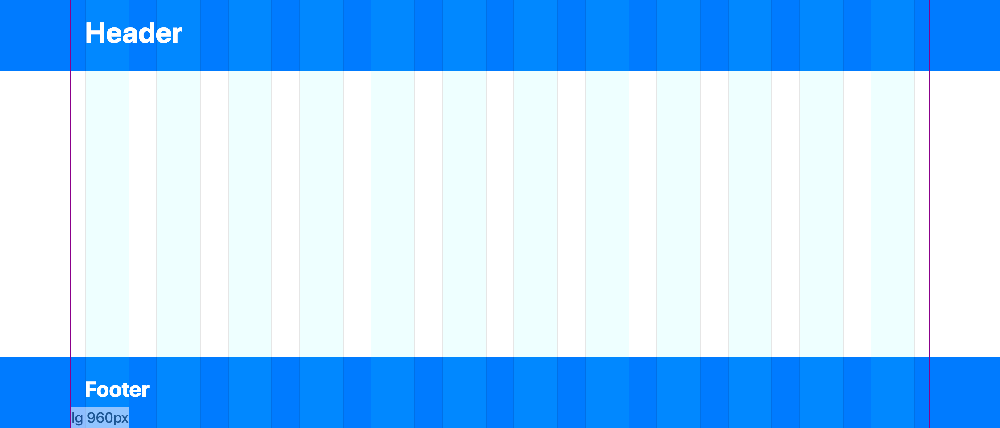

# Tips for working with CSS Grids

## Overview of Grids

A common practice in creating responsive layouts in web sites is to use what's referred to as
a grid. Grids are tools used by designers and developers alike to help layout a page, align elements within the page and help define how much of the page those elements should take up for different screen sizes.

A very common implementation is the 12 column grid which is generally used to help line up elements horizontally along "columns". They are made up of three elements:
1. A grid container, which defines the left and right side boundaries (or the width) of your site.
1. A row, which lays out grid cells, and is responsible for wrapping the cells when they don't fit.
1. A cell, which takes up space in a row. Most of the time cells take up some multiple of one 12th of the width of the grid which is how we get the 12 column effect. 

<!-- Take screenshots at 1120 x 480  -->

This is seen in some form or another popular CSS framework such as [Bootstrap](https://getbootstrap.com/docs/4.0/layout/grid/) and the [Foundation XY Grid](https://foundation.zurb.com/sites/docs/xy-grid.html), but can also be implemented as in the native CSS-grid if your browser supports it. All of these systems are capable of creating other kinds of layouts beyond the 12 column grid, but it is still a popular choice to use them for this purpose.

Working with a grid system like this isn't all scotches and skittles, there are some things that are untuitive or require some workarounds. Here are some of my tips for working with grids.

## Background Breakouts

A common web site design feature is the have backgrounds that stretch out all the way the left and right edges of the viewport while the main elements of your site remain constrained inside the grid. This is called a "breakout background".

TODO: Show figure that has full width breakout backgrounds, and outline of fixed width grid container.

The naive solution to this is to create a full width div, give it a background styling, then put a grid container inside that div. Rinse and repeat this process every time there's a new breakout background style. This is bad for at least two reasons. One, you're complicating the stucture of html to accommodate styling. We shouldn't let mere colors and pictures dictate how we structure our html! Two, the wierd html structure can have a negative impact on how you develop your site. Typically we don't just develop sites from top to bottom but from the outside in for best reusability. Having to go back to the top of the dom tree to add new elements for a breakout background will make for some awkward coding. Finally, you may run into complexities as now you have multiple grid containers, they will still line up because they share the same widths and margins but that alignment becomes brittle as your CSS grows and site matures.

Our goal is that we want to have a single grid container for the whole site and still have these breakout backgrounds. We can achieve this purely in CSS without messing with out html strucure.

The trick is that we're we use a pseudo element at the row we want to have a breakout background from and assign the background styling to it. Then we stretch that pseudo element out to the edges of the viewport.

## Nested Grids vs. Designers

## Grids are for Parents. Not for Kids