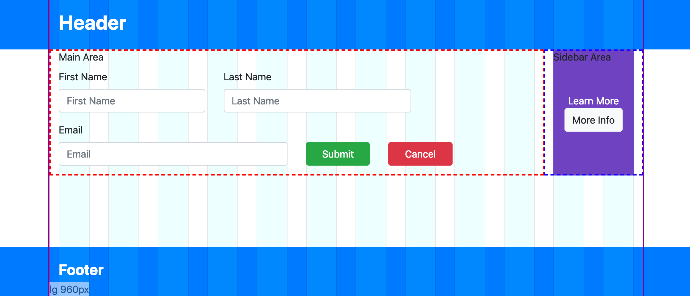

# Tips for working with CSS Grids

## Overview of Grids

A common practice in creating responsive layouts in web sites is to use what's referred to as
a grid. Grids are tools used by designers and developers alike to help layout a page, align elements within the page and help define how much of the page those elements should take up for different screen sizes.

A very common implementation is the 12 column grid which is generally used to help line up elements horizontally along "columns". They are made up of three elements:
1. A grid container, which defines the left and right side boundaries (or the width) of your site.
1. A row, which lays out grid cells, and is responsible for wrapping the cells when they don't fit.
1. A cell, which takes up space in a row. Most of the time cells take up some multiple of one 12th of the width of the grid which is how we get the 12 column effect. 


<!-- Take screenshots at 1120 x 480  -->
*The magenta outline shows the borders of the grid container. The translucent bars represent the columns that cells will align to in the grid.*

This is seen in some form or another in popular CSS frameworks such as [Bootstrap](https://getbootstrap.com/docs/4.0/layout/grid/) or [Foundation XY Grid](https://foundation.zurb.com/sites/docs/xy-grid.html), but can also be implemented in the native CSS-grid if your browser supports it. All of these systems are capable of creating other kinds of layouts beyond the 12 column grid, but it is still a popular choice to use them for this purpose.

Working with a grid system like this isn't all scotches and skittles, there are some things that are untuitive or require some workarounds. Here are some tips for working with grids.

*This post is going to focus on implementing tips in Bootstrap with [Sass](https://sass-lang.com/), though these concepts can apply to other systems.*

## Breakout Backgrounds

A common web site design feature is the have backgrounds that stretch out all the way the left and right edges of the viewport while the main elements of your site remain constrained inside the grid. We'll refer to this as a  "breakout background".

*In this design, several sections of the page have backgrounds that break out beyond the grid container (outlined in magenta)*

The naive solution to this is to create a full width div, give it a background styling, then put a grid container inside that div. Rinse and repeat this process for every section that requires a breakout background. This could work, but it's ugly. The structure of the html has been compromised to support styling, and it probably puts some tough limitations on how you code your site.

Our goal is that we want to have a single grid container for the whole site and still have these breakout backgrounds. We can achieve this purely in CSS without messing with our html strucure.

The trick is that we use a pseudo element on the element we want to have a breakout background on and then assign some background styling to it. Then we stretch that pseudo element out to the edges of the viewport.

First we start with a class that has a pseudo element positioned behind the content of its parent on the Z-axis:
```sass
// Apply this class to elements which should have breakout backgrounds
.breakout-background {
  position: relative;
  z-index: 0; // establish stacking context for breakout

  // Breakout background pseudo element
  &:before {
    content:'';
    position: absolute;
    top:0;
    height: 100%;
    width: 100vw; // Takes up 100% of the viewport width
    z-index: -1; // pseudo element is behind its parent
    background-color: blue;
  }
```
The tricky part is positioning the element horizontally so that its `left` value is the far left side of the viewport. We want it to be moved left half the viewport width, but then since it's starting it's move from the left side of the grid container we have to take the size of the grid container into consideration. So after it's moved left half the viewport width it needs to move right again by half the grid container width:
```sass
    left: calc(-100vw / 2 + #{$container-max-width} / 2);
```
Now we have to figure out what the grid container width is. In Bootstrap there's a different width for every breakpoint, so we'll need our left positioning to be different for every breakpoint as well. We can accomplish this by looping over the available breakpoints Bootstrap provides:
```sass
@each $breakpoint, $container-max-width in $container-max-widths {
  @include media-breakpoint-up($breakpoint, $grid-breakpoints) {
    left: calc(-100vw / 2 + #{$container-max-width} / 2)
  }
}
```

Our final output looks like this:

```sass
@import '~bootstrap/scss/variables';
@import '~bootstrap/scss/bootstrap-grid';
@import '~bootstrap/scss/mixins';

// Apply this class to elements which should have breakout backgrounds
.breakout-background {
  position: relative; // establish breakout positioning ancestor
  z-index: 0; // establish stacking context for breakout

  // Breakout background pseudo element
  &:before {
    content:'';
    position: absolute;
    height: 100%;
    top:0;
    width: 100vw; // Takes up 100% of the viewport width
    z-index: -1; // pseudo element is behind its parent
    background-color: blue;

    // Different left position for each breakpoint
    @each $breakpoint, $container-max-width in $container-max-widths {
      @include media-breakpoint-up($breakpoint, $grid-breakpoints) {

        // Position -50% of viewport width, then readjust right again half the grid container width
        left: calc(-100vw / 2 + #{$container-max-width} / 2)
      }
    }
  }
}
```

Now we can add this class wherever we need a background breakout:
```html
<div class="row breakout-background different-background">
  <div class="col">
    <h1>Here's a breakout background</h1>
  </div>
</div>
```

And even override the background style either using Sass inheritance or by adding a simple modifier class:
```sass
.different-background:before {
  background-image: url('./myImage.png');
  background-size: cover;
}
```

## Nested Grids vs. Designers
<!-- wordy sentence below -->
When a designer creates mockups to a 12 column grid, not only is it used for the general layout, but it's also common to align more specific elements to these grid columns. This can be good because it cuts down on the extra work of creating custom widths for various elements, those elements can squeeze down in size in a consistent way with the rest of the grid, and maybe it's more visually appealing as well.

The problem is that those pesky designers don't have a clue how you need to structure your page (nor should they!). You're building your page in boxes that nest into each other, not line by line, which leads us to the problem of nested grids.

Nested grids are exactly what they sound like. A grid nested down somewhere deeper into the cell of an existing grid.

Let's take this example to illustrate the problem.

A designer creates a mockup like this:

*This designer is a charity case. His name is Paul.*

This is the same design with the designer's grid overlay to show the alignment of components to grid columns and separation of main area and sidebar.


The problem is that when it's time to implement the design, we might end up with something that looks like this: 

*Grid overlay added to illustrate misalignment of elements*

What has happened is we've started a nested the grid in the main area, which itself is confined to a cell within a grid. Now there's no longer a set of CSS classes to help us size our elements properly. A column in a grid takes up 1/12th (or %8.3) of its parent. In this case we have a parent (the main area) that's already 10/12ths (or 83%) of the overall grid. Nesting a grid inside of that gives us columns that are about 6.9% of the overall grid container. They will never align to the designer's grid (ie, the overall grid).


*The red bars show the columns in the nested grid. Where they overlap with the overall grid columns it's grey. Since they don't line up there's not a perfect overlap.*

We need a new set of Bootstrap's `col-*` classes here for a nested grid that is 10/12ths of the overall grid. Luckily Boostrap has some Sass mixins to make this easy. It comes with a mixin called `make-grid-columns` which takes as arguments the number of columns wide you want your grid to be, and then a map of "infix" names to breakpoints. Using the existing `$grid-breakpoints` map from Bootstrap's variables we can create our ten column grid like so:

```sass
@import '~bootstrap/scss/bootstrap-grid';
@import '~bootstrap/scss/mixins';
@import '~bootstrap/scss/variables';

$breakpointsCustomColumns: (
  xs10: map-get($grid-breakpoints, xs),
  sm10: map-get($grid-breakpoints, sm),
  md10: map-get($grid-breakpoints, md),
  lg10: map-get($grid-breakpoints, lg),
  xl10: map-get($grid-breakpoints, xl),
);

@include make-grid-columns($columns: 10, $breakpoints: $breakpointsCustomColumns )
```
This will produce classes `col-xs10-1`, `col-xs10-2`, up to `col-xs10-10` for the `xs` breakpoint. Likewise for `col-sm10-1`, `col-md10-1`, `col-md10-2`, etc. for the remaining breakpoints. The keys from the breakpoints map were used as the "infix" value between the word `col-` and the column number at the end: `col-${infix}-${columnwidth}`. We can now create a grid at 1/10th widths. Using these new classes in a nested grid gives us perfect alignment with the overall grid.

*Notice how the two grids column's perflectly overlap blue and red creating the grey bars.*

Now we can take this one step further and create other col-* classes for other nested grid widths:

```sass
@mixin make-custom-grid-columns($columns) {
  $breakpointsCustomColumns: (
    xs#{$columns}: map-get($grid-breakpoints, xs),
    sm#{$columns}: map-get($grid-breakpoints, sm),
    md#{$columns}: map-get($grid-breakpoints, md),
    lg#{$columns}: map-get($grid-breakpoints, lg),
    xl#{$columns}: map-get($grid-breakpoints, xl),
  );

  @include make-grid-columns($columns: $columns, $breakpoints: $breakpointsCustomColumns )
}

$customColumnCounts: 5,7,8,9,10,11;

@each $customColumn in $customColumnCounts {
  @include make-custom-grid-columns($customColumn);
}
```
That's it! We now have other sized grid columns we can use to align sub grid columns to the overall grid the designer is aligning elements to. `col-sm5-1`, `col-sm5-2`, `col-md7-5`, etc. You may have noticed we skipped creating columns for grids that are 2, 3, 4, and 6 wide. That's because they all divide evenly into 12, so the default 12 column grid can be used on those situations.

## Grids are for Parents. Not for Kids
This tip is more of a general guideline or a best practice for working with any kind of grid system and a component based application framework such as Angular, React, Vue, or Web Components. The tip is this: A component should not know about the grid it is being layed out into.

The reasons why are reusability, and just generally knowing where to draw the line between your parent component and your child component.

So what am I talking about? Well using the 12 column grid as an example, a parent component is probably setting a layout using rows. That much makes sense. But it should also fall on the responsibility of the parent to layout the cells. The child component should not have any styling on it that says "I take up 3 columns of ... something".

Here's a brief example of the bad practice:
```html

<!-- the Parent component -->
<div>
  <h1>I'm the parent!</h1>
  <div class="row">
    <app-mychild></app-mychild>
  </div>
</div>

<!-- The child component 'app-mychild'. Assumes it needs to take up 6 columns -->
<div class="col-md-6 child-style">
  <h2>I'm the child!</h2>
  <!--  some other important child component stuff here-->
  ...
</div>
```

Here's an example of the good practice:
```html

<!-- the Parent component. Decides how much space to give the child. -->
<div>
  <h1>I'm the parent!</h1>
  <div class="row">
    <div class="col-md-6">
      <app-mychild></app-mychild>
    </div>
  </div>
</div>

<!-- The child component 'app-mychild' -->
<div class="child-style">
  <h2>I'm the child!</h2>
  <!--  some other important child component stuff here-->
  ...
</div>
```

In the good example above, the child is not coupled to any specific grid layout. It can be reused in other places where it may need to take up more space, or less space. From a layout perspective, the child component's responsibility is to either take up 100% of the space given to it by it's parent, or only as much as it needs depending on scenario.

There may be some exceptions to the rule, like if the child component only ever exists with that parent component and is never reused anywhere else, but often its probably still a good idea to follow this rule just so we know where to draw the line on layout responsibility.

This rule doesn't mean a child component can't have a grid layout of it's own, to layout its own children. That's perfectly fine as long as the grid existing entirely within the child component doesn't bleed into its own children.
